# Notes app
A simple sticky-note application. It consists of a REST API service (`notat-api`) and a single-page
web-application (`notat-web`). The `notat-api` service has an in-memory store, so don't expect much,
and please don't attempt to scale it with multiple instances.


## Step 1: Fork it
The first step is to fork this repository to your own GitHub user account. When you've forked it, you've got two options:
1. Clone the repository to your computer, and follow the rest of the instructions by performing changes
locally and pushing them to GitHub.
2. Edit the files directly in the browser, by using the editing tools baked-in to GitHub. The instructions assumes that you're using this option, but both options work equally well.

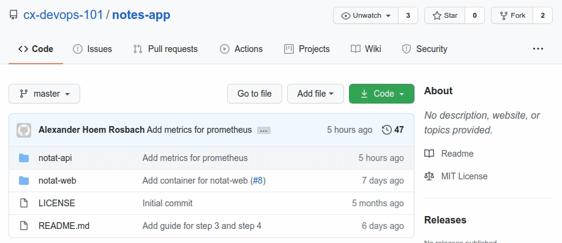

## Step 2: Setup CI
As with most DevOps oriented projects, we need some CI workflows/pipelines/jobs. Writing such pipelines
for a CI framework you haven't used before is always a big hassle, but don't worry - we've got you covered.
In your forked repository you'll find a branch named `add-ci-workflows` where we've prepared the GitHub
Actions workflows for you. You only need to do some small modifications.

### GitHub API token
The CI workflows we've set up requires a Personal Access Token with access to the GitHub API with
repository and package scopes. The workflows use this token to publish container images (on your behalf)
to your package registry. We'll need the container images later when we setup deployment to kubernetes.

First go to your personal GitHub [token settings](https://github.com/settings/tokens) and click on
`Generate new token`. Give it a sensible name, e.g. notes-app-ci, and make sure to check `write:packages`
(which will automatically select some other scopes for you as well). Click on the `Generate token` button
on the bottom of the page and then you should see your new token. Copy it.

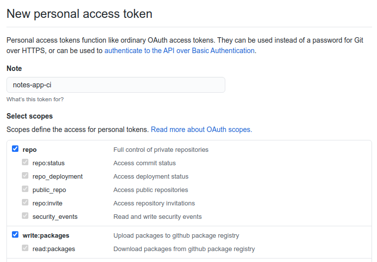

Then go back to your repository and navigate to the `Settings` tab, and again to the `Secrets` view. Click
on `New secret`, name it `CR_PAT`, paste the token you copied into the value input and add the secret.

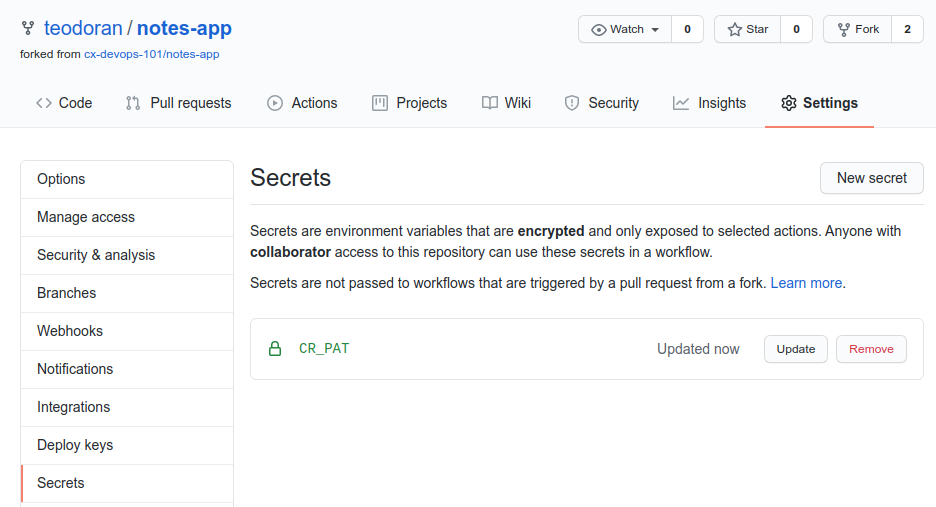

### Adapt the workflows
Before we merge the workflow declarations to the master branch of your repository, we'll need to adapt
the workflows so that they'll work with your fork of the notes-app. Navigate back to the `Code` tab of
your repository and switch to the `add-ci-workflows` branch.

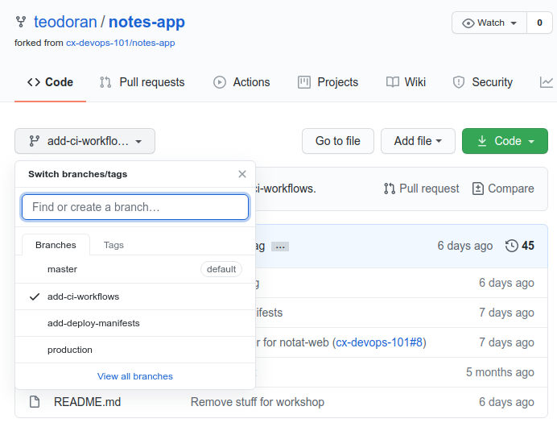

You should now see the directory `.github/workflows` directory, so navigate to it. We need to edit both 
`notat-api-ci.yaml` and `notat-web-ci.yaml`, so do the following for both files.

1. Navigate to the file, i.e click on it.
1. Click on edit (the pencil in the top-right corner of the file view).
1. Replace all `<github username>` with your GitHub username.
1. Save and commit the change.

As a side-note, in each of the files you can find a reference to the secret we added earlier:
`password: ${{ secrets.CR_PAT }}`.

### Merge the workflows
To add the workflows so that GitHub Actions executes them when changes are made to either of the
applications (notat-api or notat-web), we must create a pull-request and merge it. Navigate to the
`Pull requests` tab and click on `New pull request`. GitHub will automatically assume that you want to merge
your branch into the repository you forked, but we actually want to merge the `add-ci-workflows`-branch to our
own master-branch. To change that click on `base repository: cx-devops-101/notes-app` and select
`<username>/notes-app`. The view should change entirely and you should see a list of branches, select `add-ci-workflows`.
Create the pull-request, review the changes (i.e. make sure that you replaced `<github username>`) and merge it.

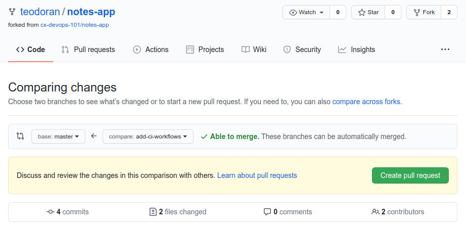

### Trigger the workflows
Now that you've merged the workflow declarations into your master branch, you should see them in the `Actions` tab.
Navigate to the `Actions` tab and verify that you can see `notat-web-CI` and `notat-api-CI` in the workflows list.

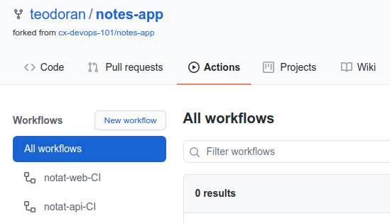

So how do we trigger them? If you studied the workflow declarations you might have noticed the `on` declaration:

```
## file: .github/workflows/notat-api-ci.yaml
on:
  push:
    branches: [ master ]
    paths:
      - 'notat-api/**'

  pull_request:
    branches: [ master ]
    paths:
      - 'notat-api/**'
```

With these two declarations, `push` and `pull_requests`, we have declared that the jobs in the workflow `notat-api-CI` should
only be executed when either of the following apply:
1. There is a new commit to the `master`-branch and any file in the path `notat-api/` has changes.
1. There is a pull-request from a branch to the `master`-branch and there are changes to any files in the path `notat-api/`.

Let's make a change to a file in the `notat-api` application and see if we can trigger the workflow:
1. Navigate to `notat-api/src/main/kotlin/com/computas/devops101/notatapi/HealthController.kt` and edit it.
1. Change the return value of `getHealthz()` from `"Healthy"` to `"Not healthy"`.
1. Scroll down to `Commit changes`.
1. Do not commit directly to the `master` branch, but rather select `Create a new branch for this commit and start a pull request`.
1. Create the pull request.
1. Wait a few seconds and you should see that the workflow has been triggered.

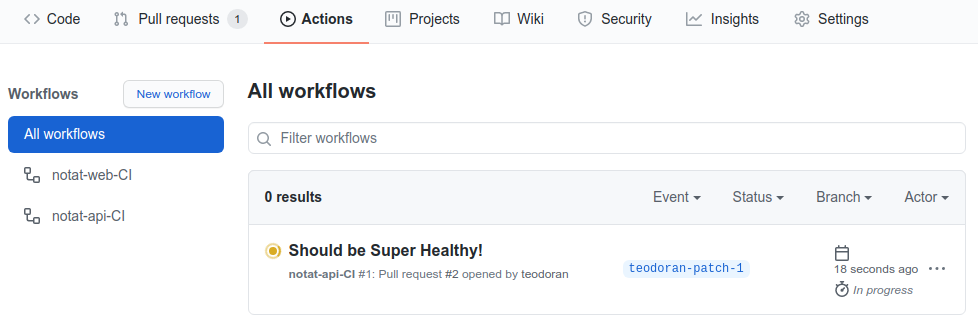

The workflow that we triggered is executed because (2) from the `on`-declaration applies in this case. It will verify that our
changes does not break anything by compiling the code, running tests and building the container image. Note that the difference
between executions where (1) and (2) apply is the `push: ${{github.ref == 'refs/heads/master'}}` which will evaluate to false when
executed for pull-requests.

### Build failed!

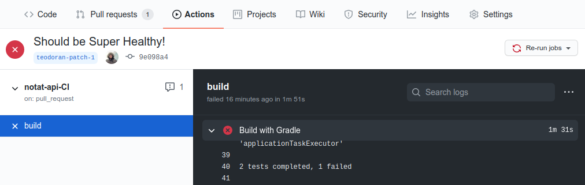

What happened? The job failed right? The reason? Well, we broke a unit test with our change and we might also have broken
expecations that other applications has about the API. The API specification in our case states that valid answers for that endpoint
is `Ok` or `Healthy`. We still want to make a change that will trigger a build so, let's change it to `Ok` instead.

1. Navigate to the `Code` tab.
1. Switch to the branch you created for the pull-request, e.g. `<username>-patch-1`
1. Navigate to `notat-api/src/main/kotlin/com/computas/devops101/notatapi/HealthController.kt` and edit it.
1. Change the return value of `getHealthz()` from `"Not healthy"` to `"Ok"`.
1. Scroll down to `Commit changes`
1. This time we want to commit directly to the `<username>-patch-1` branch.
1. Commit.

And voilà, the workflow should be successful and we can go ahead and merge the pull-request.

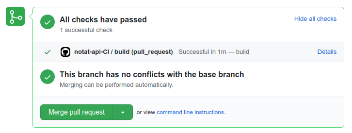

### Build from master
Merging the pull-request will trigger the `notat-api-CI` workflow for the master branch. When triggered by a change on the master-branch, the workflow will push the container image to your GitHub package registry.

When the workflow is successful you can verify this by going to your GitHub profile page and navigate to the `Packages` tab, where you should find the `notes-app/notat-api` container.

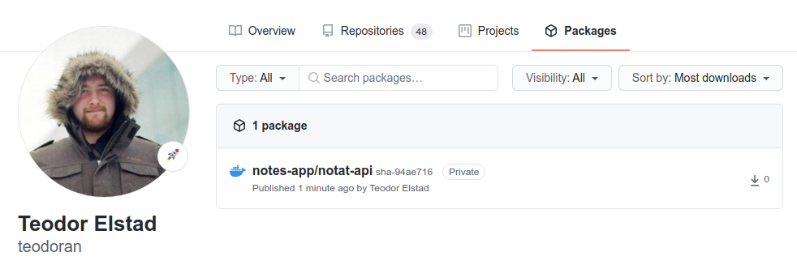

Make a note of the container image tag, e.g. something like `sha-c92ee65`, preferably save it
somewhere. We also have to change the visibility of the container from private to public.

1. Click on the `notes-app/notat-api` container.
1. Click on `Package Settings`.
1. Scroll down to the `Danger Zone` and click on `Make public`.
1. (Optional) If you have docker on your computer you can verify that it is public if you want to:
  - `docker run --rm -it ghcr.io/<github username>/notes-app/notat-api`

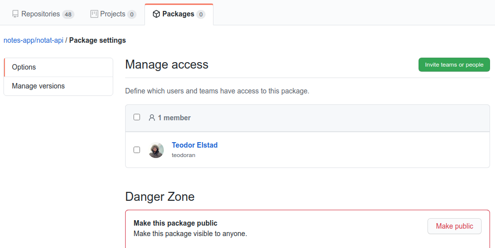

### Build the frontend
Let's trigger the `notat-web-CI` workflow as well, but this time we'll skip failing and fixing a test.

1. Navigate to the master branch and the file `notat-web/index.html`, and edit it.
1. Add a new-line at the end of the file.
1. Do not commit directly to the `master` branch, but rather select `Create a new branch for this commit and start a pull request`.
1. Create the pull request
1. Wait a few seconds and you should see that the workflow has been triggered.

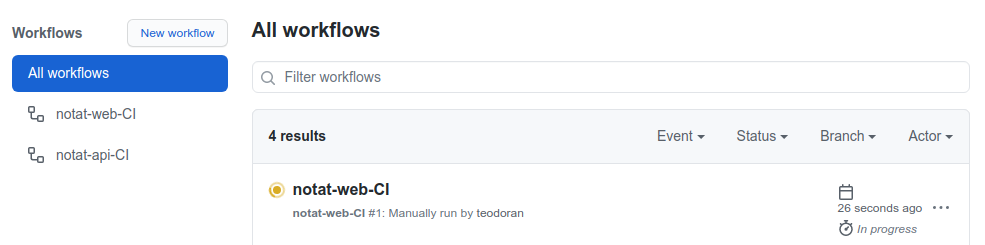

The workflow should execute successfully, and when it is you can safely approve and merge the pull-request. Which, again, should
trigger the workflow, and when it's successful we should find the container in the `Packages` list.

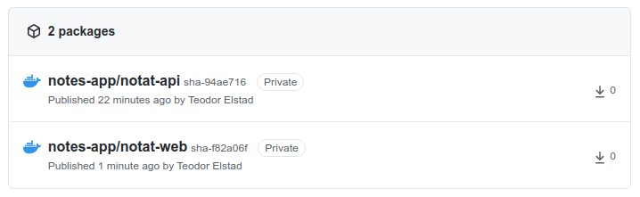

Make a note of the `notes-web` container image tag as well, e.g. something like `sha-c92ee65`, preferably save it somewhere. Go ahead and change the visibility to public for it as well. And similarly, if you want to, you can verify that it is public with docker locally:
`docker run --rm -it ghcr.io/<github username>/notes-app/notat-web`.

## Step 3: Add deployment manifests
At this point we hope that you're positively steaming with anticipation of how your brand new Sticky Notes application looks,
and you're ready to experience it's wonders. Before you can do that though, you must declare how it shall be deployed.
For the purposes of this workshop we've elected to use [Kubernetes](https://kubernetes.io/), so we need Kubernetes workload manifests, which we of course have prepared for you.

### Adapt the workflows
The manifests that we've prepared for you require some changes for them to work for your notes-app. So go ahead and navigate
to the `Code` tab of your repository in GitHub, and switch to the `add-deploy-manifests`-branch. You should see the `k8s`
directory in the root of the repository, navigate to it.

There are three files you need to modify, but the changes are more or less the same, so this should be easy.
When you've modifed a file and need to save it, add the change as a commit directly
to the `add-deploy-manifests`-branch.

1. `k8s/ingress.yaml`: Replace `<username>` with the hostname you desire ([a-z0-9]+), preferably your GitHub username.
2. `k8s/notat-api-deployment.yaml`:
  - Replace `<github username>` with your GitHub username.
  - Replace `<image-tag>` with your tag you made a note about earlier for the `notat-api` container.
3. `k8s/notat-web-deployment.yaml`:
  - Replace `<github username>` with your GitHub username.
  - Replace `<image-tag>` with your tag you made a note about earlier for the `notat-web` container.

When you've made all the changes you should have added three new commits to the `add-deploy-manifests`-branch, and we should
be ready to merge the branch into master. Create a pull-request and merge it, though remember that GitHub automatically selects
the repository you forked as base repository, but you should select your own repository as base. To change that click on
`base repository: cx-devops-101/notes-app` and select `<username>/notes-app`. The view should change entirely and you should see
a list of branches, select `add-deploy-manifests`. Create the pull-request, review the changes and merge it.

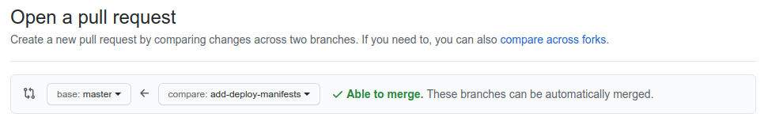

## Step 4: Add deployment to cluster
We're getting closer to a complete CI/CD setup. What remains is to tell the Kubernetes cluster we want to deploy to about our
deployment manifests. In our cluster there is an operator that continuously checks the `cx-devops-101/k8s-infra` repository for
changes, so our goal at this point is to add a pull-request to that repository where we tell the operator about our application.

Go to [cx-devops-101/k8s-infra](https://github.com/cx-devops-101/k8s-infra), fork it and continue with the instructions you find
there.
